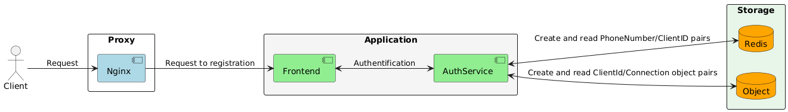

# Telegram Auth Service

A secure and scalable authentication service leveraging Telegram's API for user verification and session management.



## Table of Contents

- [Overview](#overview)
- [Features](#features)
- [Available Commands](#available-commands)
- [Prerequisites](#prerequisites)
- [Technologies](#technologies-used)
- [Installation and Usage](#installation-and-usage)
- [Contributors](#contributors)

## Overview

The Telegram Auth Service provides seamless authentication using Telegram's API, enabling applications to:
- Verify user identity via Telegram credentials
- Manage user sessions securely

This service acts as a middleware between your application and Telegram's authentication system, handling all the complex verification processes while providing a simple API interface.

## Features

- **Telegram Login Integration**
- **Session Management**
- **Scalable Architecture**

## Prerequisites

Before installation, ensure you have:

- **Docker**: Engine 24.0+ and Docker Compose 2.20+
- **Telegram API Credentials**:
  - API ID (obtain from [my.telegram.org](https://my.telegram.org))
  - API HASH (obtain from [my.telegram.org](https://my.telegram.org))
- **Hardware**:
  - Minimum: 1 CPU cores, 2GB RAM

## Technologies Used

- **Authentication Service**: Python (3.13)
  - Framework: FastAPI (0.116.0)
  - Database: Redis (8.0.3)
- **Frontend**: NodeJS (22.14)
  - Framework: Quasar (2.5.0)

## Installation and Usage

To use the Telegram auth service, you will need to:

### Step 1: Clone the Repository

First, clone this repository using Git:

```bash
git clone https://github.com/YAC-coders/telegram_auth_service.git
```

This will create a local copy of the project on your machine.

### Step 2: Configure Your Instance

Next, create a new file named `.env` in the root of this repository.
This file is used for configuration purposes.
Please add your desired settings to this file. Use .env.example as a reference.

### Step 3: Run the Makefile

Run the following command:

```bash
make
```

This will start up the necessary services for the Telegram Auth service.

## Contributors

This project is maintained by:

- [Vitaly Menkeev](https://github.com/VitalyMenkeev)
- [Ivan Kolesnikov](https://github.com/VanyaKolesnikov)
